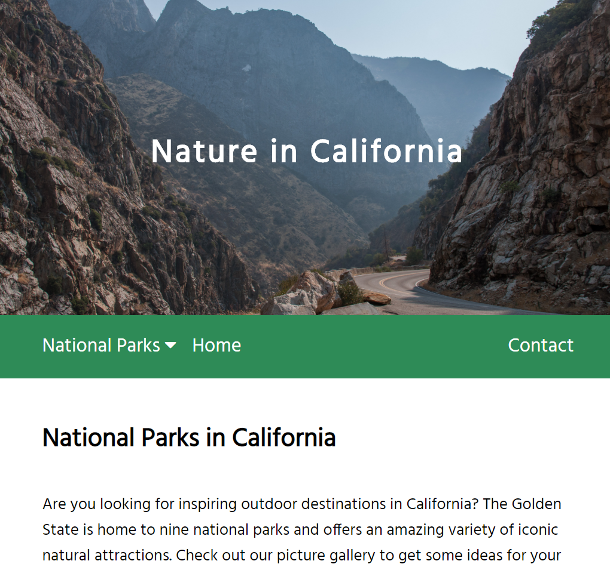
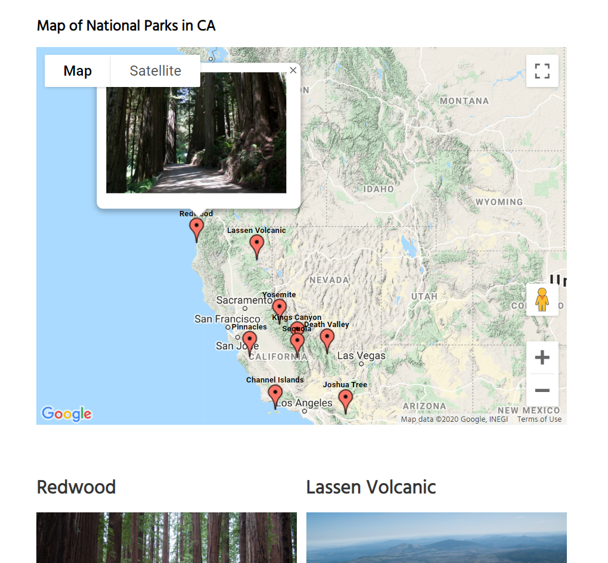
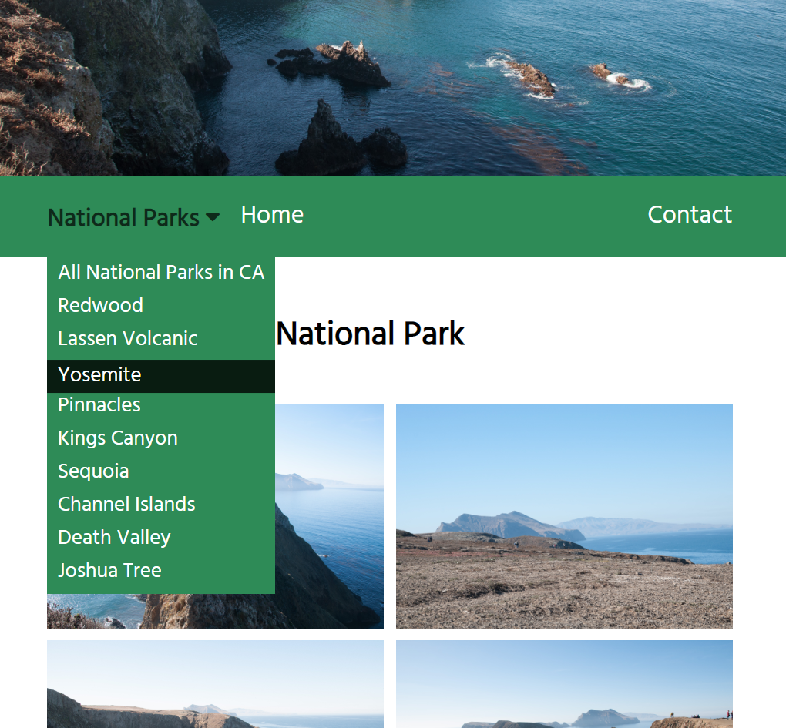
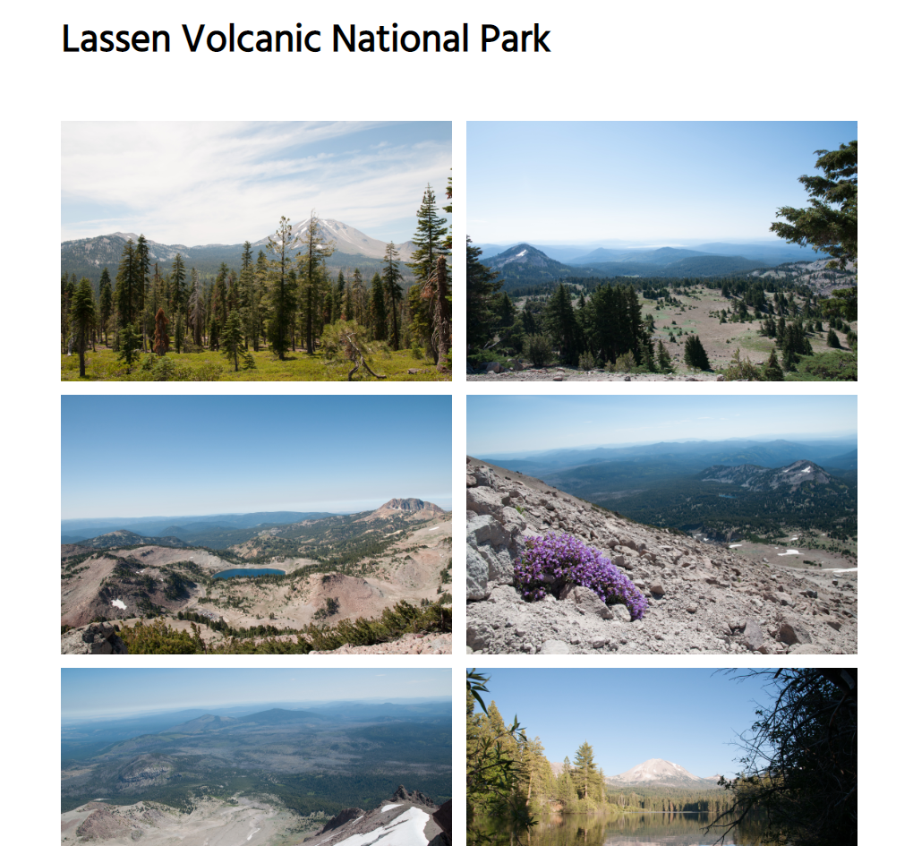

# nature-california
## Project: Responsive Photo Gallery Website with GoogleMaps

 <h3>Description>/h3>
                            
The main purpose of this project was to build a responsive photo gallery website - Nature in California. The website shows photos from the nine national parks of California using various column layouts for different devises. The website also includes embedded Google maps with the national park locations pinned and sharing buttons of social media.
                           
                            <h4>Developing Tools:</h4>
                            <ul>
                                <li>HTML5</li>
                                <li>CSS Grid</li>
                                <li>Javascript</li>
                                <li>Google Maps API</li>
                                <li>Facebook API</li>
                                <li>Twitter API</li>
                            </ul>
                            <h4>Features:</h4>
                            <ul>
                                <li>The responsive layout of the photo gallery is achieved with the CSS Grid. The number of photo columns changes depending on the screen size and makes it more convenient for the user to watch the photos.</li>
                                <li>Navigation bar with a list of the national parks lets the user go to a selected park page and view its photo gallery.</li>
                                <li>An embedded Google map displays labels and locations of the nine national parks in CA. The Javascript code provides the option of displaying a small photo of every park and the address on the map.</li>
                                <li>The website displays Like and Share buttons included with Facebook API.</li>
                                <li>The website displays the Tweet button and a timeline with updates of the National Park Service included with Twitter API.</li>
                                <li>Provided links to the official webpages of the national parks make it convinient for the user to find out more information about the park.</li>
                            </ul>
<h4>Website Screenschots:</h4>                          

                            
